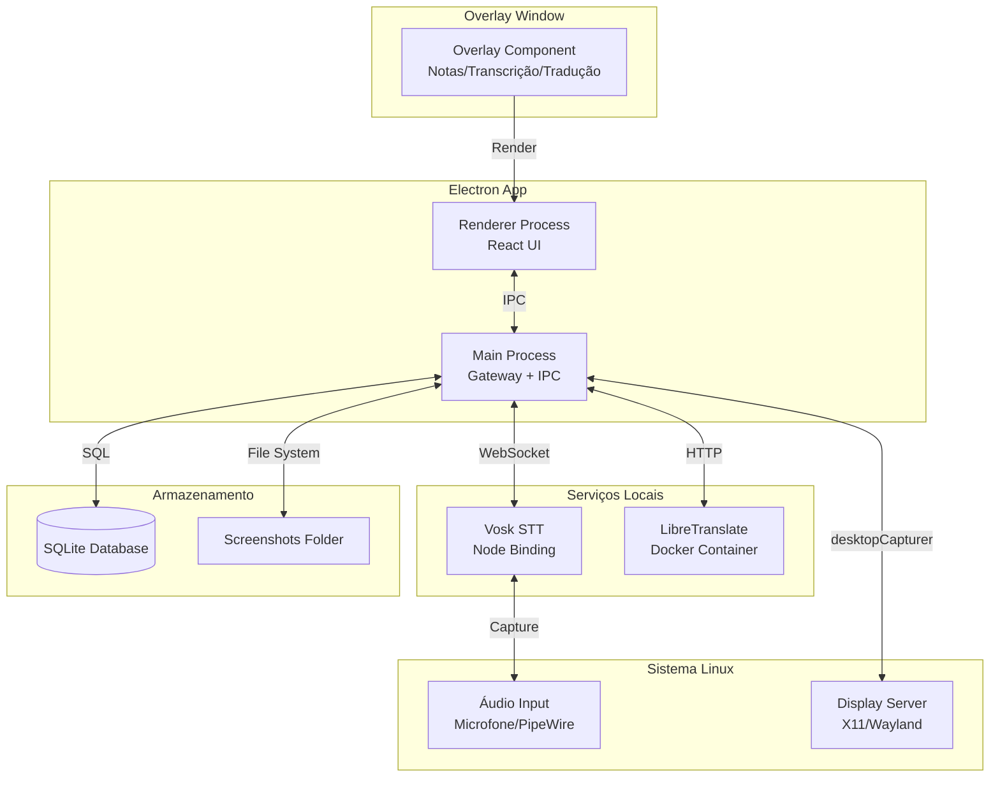
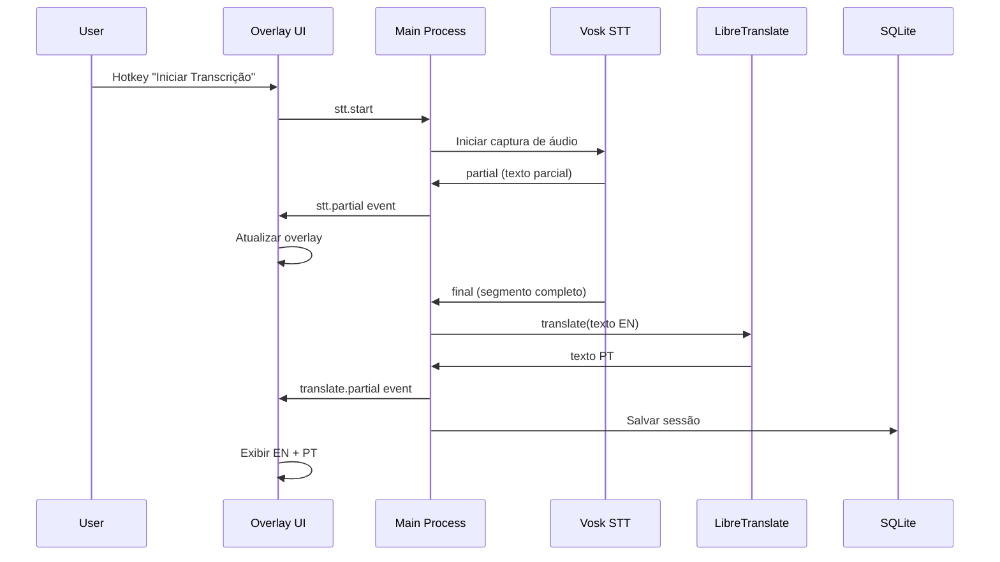

# Ricky - Assistente Pessoal Desktop

## 1. PRD (Product Requirements Document)

### 1.1 Visão do Produto

Ricky é um assistente pessoal desktop para Linux que funciona como overlay/companion durante reuniões e apresentações, oferecendo funcionalidades de produtividade sem comprometer a privacidade (tudo local) e sem interferir no fluxo de trabalho principal.

### 1.2 Personas e Casos de Uso

**Persona 1: Profissional em Reunião Internacional**

- Precisa entender conversas em inglês em tempo real
- Quer anotações rápidas sem trocar de janela
- Não pode interromper a apresentação com pop-ups

**Persona 2: Apresentador**

- Precisa de teleprompter discreto durante apresentação
- Quer capturar momentos importantes da tela
- Precisa alternar entre notas e tradução rapidamente

**Persona 3: Estudante em Aula Online**

- Quer transcrever aulas para revisão posterior
- Precisa traduzir conteúdo em inglês
- Quer histórico de capturas de tela organizado

### 1.3 User Stories MVP

**US-001: Overlay de Notas**

- Como usuário, quero um overlay sempre visível com minhas notas, para não perder contexto durante apresentações.
- Critérios de aceitação:
    - Overlay pode ser movido, redimensionado e ajustado em opacidade
    - Texto persiste entre sessões
    - Hotkey global para mostrar/ocultar
    - Não rouba foco quando atualiza conteúdo

**US-002: Captura de Tela Sob Comando**

- Como usuário, quero capturar a tela com um hotkey, para documentar momentos importantes sem interromper o fluxo.
- Critérios de aceitação:
    - Hotkey global funciona mesmo com app minimizado
    - Preview da captura antes de salvar
    - Histórico com timestamp e identificação da fonte
    - Suporta tela inteira e janela específica (X11 e Wayland)

**US-003: Transcrição Offline em Tempo Real**

- Como usuário, quero transcrever áudio do microfone em tempo real, para acompanhar conversas sem depender de serviços em nuvem.
- Critérios de aceitação:
    - Inicia/para transcrição sob comando (hotkey ou botão)
    - Texto aparece em streaming no overlay
    - Funciona offline usando Vosk
    - Suporta inglês (MVP), português (fase 2)

**US-004: Tradução Offline EN->PT**

- Como usuário, quero traduzir texto transcrito do inglês para português em tempo real, para entender conteúdo internacional.
- Critérios de aceitação:
    - Tradução automática do texto transcrito
    - Exibe original e traduzido lado a lado
    - Funciona offline via LibreTranslate
    - Latência < 2s por segmento

**US-005: Modo Apresentação**

- Como usuário, quero um modo que minimize interferências visuais, para não distrair durante apresentações compartilhadas.
- Critérios de aceitação:
    - Hotkey para ocultar overlay instantaneamente
    - Overlay não aparece em screen share (se possível detectar)
    - Estado persistido entre sessões

### 1.4 Métricas de Sucesso MVP

- **Funcionalidade**: 100% das features MVP funcionando offline
- **Performance**: Latência de transcrição < 500ms por palavra, tradução < 2s por segmento
- **Usabilidade**: Overlay pode ser configurado em < 30s na primeira execução
- **Robustez**: App não trava mesmo se containers STT/Translate não estiverem rodando
- **Privacidade**: Zero requisições de rede (exceto opcional LLM futuro)

---

## 2. Arquitetura

### 2.1 Diagrama de Componentes



### 2.2 Fluxo de Dados - Transcrição e Tradução



### 2.3 Decisões Arquiteturais

**Gateway no Electron Main Process**

- Justificativa: Reduz overhead de processos, comunicação IPC nativa, gerenciamento de ciclo de vida simplificado
- Alternativa rejeitada: Processo separado (mais complexo, sem benefício claro no MVP)

**Vosk via Binding Direto**

- Justificativa: Menor latência, sem overhead de rede, controle total sobre modelo
- Limitação: Requer compilação nativa, mais complexo de distribuir
- Fallback: Se binding falhar, usar Vosk Server via Docker

**WebSocket Local (127.0.0.1:8787)**

- Justificativa: Comunicação bidirecional, baixa latência, fácil debug
- Segurança: Apenas localhost, sem exposição externa

**SQLite para Armazenamento**

- Justificativa: Zero configuração, ACID, suficiente para dados locais
- Alternativa considerada: JSON files (rejeitada por falta de queries complexas)

### 2.4 Bibliotecas Recomendadas

| Biblioteca | Versão | Justificativa |

|------------|--------|---------------|

| `electron` | ^28.x | Framework desktop, suporte Wayland/X11 |

| `react` | ^18.x | UI declarativa, ecossistema maduro |

| `typescript` | ^5.x | Type safety, melhor DX |

| `ws` | ^8.x | WebSocket server local |

| `better-sqlite3` | ^9.x | SQLite síncrono, performático |

| `node-vosk` | latest | Binding Vosk para Node.js |

| `sharp` | ^0.33.x | Processamento de imagens (screenshots) |

| `electron-store` | ^8.x | Configurações persistentes |

| `globalthis` | ^1.x | Polyfill para hotkeys globais |

| `@electron/remote` | ^2.x | Acesso remoto a APIs (se necessário) |

**Dependências de Sistema (Linux)**

- `libvips-dev` (para sharp)
- `portaudio19-dev` (para captura de áudio)
- `pipewire` ou `pulseaudio` (áudio)
- `xdg-desktop-portal` (Wayland screen capture)

### 2.5 Limitações e Fallbacks

**Wayland Screen Capture**

- Limitação: `desktopCapturer` pode não funcionar em todas as distribuições
- Fallback: Usar `xdg-desktop-portal` via `electron.screen` API
- Detecção: Verificar `process.env.WAYLAND_DISPLAY` ou `XDG_SESSION_TYPE`

**Vosk Binding**

- Limitação: Compilação nativa pode falhar em algumas distros
- Fallback: Docker container com Vosk Server + WebSocket client
- Detecção: Tentar importar `node-vosk`, se falhar usar fallback

**Áudio do Sistema (PipeWire)**

- Limitação: Capturar áudio do sistema é complexo no Linux
- MVP: Apenas microfone
- Fase 2: Usar `pipewire-pulse` com monitor sink

---

## 3. Estrutura do Repositório

```
assistente-pessoal/
├── apps/
│   └── desktop/                 # Electron app
│       ├── src/
│       │   ├── main/            # Main process
│       │   │   ├── index.ts     # Entry point
│       │   │   ├── gateway.ts   # WebSocket gateway
│       │   │   ├── stt.ts       # Vosk integration
│       │   │   ├── translate.ts # LibreTranslate client
│       │   │   ├── screenshot.ts # Screen capture
│       │   │   └── database.ts  # SQLite wrapper
│       │   ├── renderer/        # React app
│       │   │   ├── App.tsx
│       │   │   ├── components/
│       │   │   │   ├── Overlay.tsx
│       │   │   │   ├── NotesPanel.tsx
│       │   │   │   ├── TranscriptionPanel.tsx
│       │   │   │   ├── TranslationPanel.tsx
│       │   │   │   └── ScreenshotPreview.tsx
│       │   │   ├── hooks/
│       │   │   │   ├── useWebSocket.ts
│       │   │   │   └── useHotkeys.ts
│       │   │   └── store/       # State management (Zustand/Jotai)
│       │   └── preload.ts       # Preload script
│       ├── public/
│       ├── electron-builder.yml
│       └── package.json
│
├── services/
│   ├── stt/                     # Vosk (binding direto, sem Docker no MVP)
│   │   └── README.md            # Instruções de setup
│   └── translate/               # LibreTranslate Docker
│       ├── docker-compose.yml
│       └── README.md
│
├── packages/
│   └── shared/                  # Tipos e contratos compartilhados
│       ├── src/
│       │   ├── types/
│       │   │   ├── events.ts    # WebSocket event types
│       │   │   ├── database.ts  # DB schema types
│       │   │   └── config.ts    # Config types
│       │   └── constants.ts
│       └── package.json
│
├── scripts/
│   ├── dev.sh                   # Inicia dev environment
│   ├── build.sh                  # Build produção
│   └── setup-containers.sh       # Setup Docker services
│
├── .gitignore
├── pnpm-workspace.yaml
├── package.json                 # Root package.json
├── tsconfig.json                # Base TS config
└── README.md
```

### 3.1 Arquivos Iniciais

**pnpm-workspace.yaml**

```yaml
packages:
 - 'apps/*'
 - 'packages/*'
```

**package.json (root)**

```json
{
  "name": "ricky-assistente-pessoal",
  "private": true,
  "scripts": {
    "dev": "pnpm --filter desktop dev",
    "build": "pnpm -r build",
    "lint": "pnpm -r lint",
    "typecheck": "pnpm -r typecheck",
    "setup": "./scripts/setup-containers.sh"
  },
  "devDependencies": {
    "typescript": "^5.3.3",
    "@types/node": "^20.10.0"
  }
}
```

**tsconfig.json (base)**

```json
{
  "compilerOptions": {
    "target": "ES2022",
    "module": "ESNext",
    "lib": ["ES2022"],
    "moduleResolution": "bundler",
    "strict": true,
    "esModuleInterop": true,
    "skipLibCheck": true,
    "forceConsistentCasingInFileNames": true
  }
}
```

---

## 4. Protocolo WebSocket

### 4.1 Endpoint

- URL: `ws://127.0.0.1:8787`
- Protocolo: Text frames (JSON)

### 4.2 Eventos (Request/Response)

**Overlay**

```typescript
// Request
{ type: "overlay.toggle", payload: {} }
// Response
{ type: "overlay.toggle.response", payload: { visible: boolean } }

{ type: "overlay.setOpacity", payload: { opacity: number } }
{ type: "overlay.setOpacity.response", payload: { success: boolean } }
```

**Screenshot**

```typescript
// Request
{ type: "screenshot.capture", payload: { mode: "fullscreen" | "window" } }
// Response
{ type: "screenshot.capture.response", payload: { 
  success: boolean, 
  path?: string, 
  timestamp: number 
} }
```

**STT**

```typescript
// Request
{ type: "stt.start", payload: { language?: "en" | "pt" } }
{ type: "stt.stop", payload: {} }

// Push events (server -> client)
{ type: "stt.partial", payload: { text: string, confidence: number } }
{ type: "stt.final", payload: { text: string, timestamp: number } }
{ type: "stt.error", payload: { message: string } }
```

**Translation**

```typescript
// Push events (server -> client, automático após stt.final)
{ type: "translate.partial", payload: { 
  original: string, 
  translated: string, 
  source: "en", 
  target: "pt" 
} }
```

**Database**

```typescript
// Request
{ type: "db.getNotes", payload: {} }
{ type: "db.getNotes.response", payload: { notes: Note[] } }

{ type: "db.saveNote", payload: { content: string } }
{ type: "db.getSessions", payload: { limit?: number } }
```

### 4.3 Estados do Sistema

```typescript
enum SystemState {
  IDLE = "idle",
  TRANSCRIBING = "transcribing",
  ERROR = "error",
  INITIALIZING = "initializing"
}

// Evento de estado
{ type: "system.state", payload: { state: SystemState, message?: string } }
```

### 4.4 Exemplo de Payload Completo

```typescript
// Cliente envia
{
  id: "req-123",
  type: "stt.start",
  payload: { language: "en" },
  timestamp: 1703123456789
}

// Servidor responde
{
  id: "req-123",
  type: "stt.start.response",
  payload: { success: true, state: "transcribing" },
  timestamp: 1703123456790
}

// Servidor envia push (sem id de request)
{
  type: "stt.partial",
  payload: { text: "Hello world", confidence: 0.95 },
  timestamp: 1703123456800
}
```

---

## 5. Banco de Dados (SQLite)

### 5.1 Schema Inicial

```sql
-- Notas do usuário
CREATE TABLE notes (
  id INTEGER PRIMARY KEY AUTOINCREMENT,
  content TEXT NOT NULL,
  created_at INTEGER NOT NULL,  -- Unix timestamp
  updated_at INTEGER NOT NULL,
  panel_type TEXT DEFAULT 'notes'  -- 'notes' | 'transcription' | 'translation'
);

-- Sessões de transcrição
CREATE TABLE transcription_sessions (
  id INTEGER PRIMARY KEY AUTOINCREMENT,
  started_at INTEGER NOT NULL,
  ended_at INTEGER,
  language TEXT DEFAULT 'en',
  total_segments INTEGER DEFAULT 0
);

-- Segmentos de transcrição
CREATE TABLE transcription_segments (
  id INTEGER PRIMARY KEY AUTOINCREMENT,
  session_id INTEGER NOT NULL,
  text TEXT NOT NULL,
  translated_text TEXT,
  confidence REAL,
  timestamp INTEGER NOT NULL,
  FOREIGN KEY (session_id) REFERENCES transcription_sessions(id)
);

-- Capturas de tela
CREATE TABLE screenshots (
  id INTEGER PRIMARY KEY AUTOINCREMENT,
  file_path TEXT NOT NULL UNIQUE,
  file_size INTEGER,
  width INTEGER,
  height INTEGER,
  mode TEXT NOT NULL,  -- 'fullscreen' | 'window' | 'area'
  source_app TEXT,     -- Nome da janela capturada (se disponível)
  monitor_index INTEGER,
  created_at INTEGER NOT NULL
);

-- Eventos do sistema (logs estruturados)
CREATE TABLE system_events (
  id INTEGER PRIMARY KEY AUTOINCREMENT,
  event_type TEXT NOT NULL,  -- 'screenshot' | 'transcription_start' | 'error'
  payload TEXT,               -- JSON
  created_at INTEGER NOT NULL
);

-- Índices
CREATE INDEX idx_notes_updated ON notes(updated_at DESC);
CREATE INDEX idx_sessions_started ON transcription_sessions(started_at DESC);
CREATE INDEX idx_segments_session ON transcription_segments(session_id, timestamp);
CREATE INDEX idx_screenshots_created ON screenshots(created_at DESC);
CREATE INDEX idx_events_created ON system_events(created_at DESC);
```

### 5.2 Queries Básicas

```sql
-- Últimas 10 notas
SELECT * FROM notes ORDER BY updated_at DESC LIMIT 10;

-- Sessões de transcrição do último dia
SELECT * FROM transcription_sessions 
WHERE started_at > (strftime('%s', 'now') - 86400)
ORDER BY started_at DESC;

-- Segmentos de uma sessão com tradução
SELECT text, translated_text, timestamp 
FROM transcription_segments 
WHERE session_id = ? 
ORDER BY timestamp;

-- Screenshots do último mês
SELECT * FROM screenshots 
WHERE created_at > (strftime('%s', 'now') - 2592000)
ORDER BY created_at DESC;

-- Estatísticas de uso
SELECT 
  COUNT(*) as total_screenshots,
  SUM(file_size) as total_size_bytes
FROM screenshots
WHERE created_at > (strftime('%s', 'now') - 86400);
```

---

## 6. Backlog de Implementação

### Sprint 1: Fundação (Semana 1-2)

**Tarefas:**

1. **Setup Monorepo** (S)

      - Configurar pnpm workspaces
      - Estrutura de pastas inicial
      - TypeScript base config
      - Dependências: pnpm, typescript, electron

2. **Electron Base** (M)

      - Main process entry point
      - Renderer process com React
      - Preload script básico
      - IPC básico funcionando
      - Dependências: electron, react, react-dom

3. **Overlay Window** (M)

      - Janela always-on-top
      - Drag, resize, opacidade
      - Toggle show/hide
      - Dependências: electron

4. **WebSocket Gateway** (M)

      - Servidor WS no main process
      - Tipos de eventos básicos (packages/shared)
      - Handlers vazios (stubs)
      - Dependências: ws, @types/ws

5. **SQLite Setup** (S)

      - Schema inicial
      - Wrapper de database
      - Migrations básicas
      - Dependências: better-sqlite3

**Definição de Done Sprint 1:**

- App abre e mostra overlay vazio
- Overlay pode ser movido e redimensionado
- WebSocket responde a eventos básicos
- Database criado com schema inicial

---

### Sprint 2: UI e Notas (Semana 3-4)

**Tarefas:**

1. **Componentes Base UI** (M)

      - Overlay container
      - Painéis (Notes/Transcription/Translation)
      - Toggle entre painéis
      - Dependências: react, styled-components ou tailwind

2. **Painel de Notas** (M)

      - Editor de texto (textarea ou contenteditable)
      - Salvar/carregar do DB
      - Persistência automática
      - Dependências: better-sqlite3

3. **Hotkeys Globais** (M)

      - Registrar hotkeys no main process
      - Toggle overlay
      - Alternar painéis
      - Dependências: electron (globalShortcut) ou globalthis

4. **Configurações Básicas** (S)

      - Opacidade persistida
      - Posição/tamanho persistidos
      - Modo apresentação (toggle)
      - Dependências: electron-store

**Definição de Done Sprint 2:**

- Usuário pode escrever e salvar notas
- Hotkeys funcionam globalmente
- Overlay mantém estado entre sessões
- UI responsiva e não rouba foco

---

### Sprint 3: Captura de Tela (Semana 5-6)

**Tarefas:**

1. **Screen Capture X11** (M)

      - desktopCapturer API
      - Captura tela inteira
      - Preview antes de salvar
      - Dependências: electron, sharp

2. **Screen Capture Wayland** (M)

      - xdg-desktop-portal integration
      - Fallback para X11 se necessário
      - Detecção automática de display server
      - Dependências: electron

3. **Histórico de Screenshots** (M)

      - Salvar no DB
      - Lista de previews
      - Abrir pasta, copiar para clipboard
      - Dependências: electron (shell), sharp

4. **Hotkey Screenshot** (S)

      - Hotkey global para captura
      - Feedback visual (toast)
      - Dependências: electron

**Definição de Done Sprint 3:**

- Captura funciona em X11 e Wayland
- Screenshots salvos com metadata
- Histórico acessível via UI
- Hotkey funciona mesmo com app minimizado

---

### Sprint 4: STT e Tradução (Semana 7-8)

**Tarefas:**

1. **Vosk Integration** (L)

      - Instalar node-vosk (ou fallback Docker)
      - Configurar modelo de idioma (en)
      - Captura de áudio do microfone
      - Streaming de resultados parciais
      - Dependências: node-vosk, portaudio

2. **STT Gateway Handler** (M)

      - Handler stt.start/stop no gateway
      - Eventos stt.partial/final
      - Gerenciamento de estado
      - Salvar segmentos no DB
      - Dependências: ws, better-sqlite3

3. **Painel de Transcrição** (M)

      - Exibir texto em streaming
      - Timestamps opcionais
      - Scroll automático
      - Dependências: react

4. **LibreTranslate Setup** (S)

      - Docker compose config
      - Script de setup
      - Health check
      - Dependências: docker, docker-compose

5. **Translation Integration** (M)

      - Cliente HTTP para LibreTranslate
      - Traduzir segmentos finais automaticamente
      - Cache de traduções (opcional)
      - Dependências: axios ou fetch

6. **Painel de Tradução** (M)

      - Exibir EN + PT lado a lado
      - Histórico de traduções
      - Dependências: react

**Definição de Done Sprint 4:**

- Transcrição funciona offline com Vosk
- Tradução funciona via LibreTranslate
- Texto aparece em tempo real nos painéis
- Sessões salvas no DB
- Tratamento de erros (containers não rodando)

---

### Sprint 5: Polimento e Distribuição (Semana 9-10)

**Tarefas:**

1. **Modo Apresentação** (S)

      - Hotkey para ocultar overlay
      - Estado persistido
      - Feedback visual

2. **Logging e Observabilidade** (S)

      - Logger com níveis (winston ou pino)
      - Arquivo de log local
      - Eventos críticos no DB

3. **Error Handling** (M)

      - Mensagens amigáveis
      - Instruções quando serviços não estão rodando
      - Retry automático para tradução

4. **Build e Distribuição** (M)

      - electron-builder config
      - AppImage build
      - .deb build (opcional)
      - Scripts de release

5. **Documentação** (S)

      - README completo
      - Guia de instalação
      - Troubleshooting

**Definição de Done Sprint 5:**

- App pronto para uso
- Builds funcionando
- Documentação completa
- Todos os requisitos MVP atendidos

---

## 7. Setup Local (Linux)

### 7.1 Dependências do Sistema

```bash
# Node.js e pnpm
curl -fsSL https://deb.nodesource.com/setup_20.x | sudo -E bash -
sudo apt install -y nodejs
npm install -g pnpm

# Docker e Docker Compose
sudo apt install -y docker.io docker-compose
sudo usermod -aG docker $USER
# (logout/login necessário)

# Dependências de build
sudo apt install -y \
  build-essential \
  libvips-dev \
  portaudio19-dev \
  python3-dev

# Áudio (PipeWire ou PulseAudio)
sudo apt install -y pipewire pipewire-pulse

# Wayland portals (para captura de tela)
sudo apt install -y xdg-desktop-portal xdg-desktop-portal-gtk
```

### 7.2 Passo a Passo de Execução

```bash
# 1. Clone e instale dependências
cd /home/jesus/Neurelix/assistente\ pessoal
pnpm install

# 2. Setup LibreTranslate (Docker)
cd services/translate
docker-compose up -d
# Verificar: curl http://localhost:5000/languages

# 3. Download modelo Vosk (inglês, ~1.8GB)
mkdir -p ~/.local/share/ricky/vosk-models
cd ~/.local/share/ricky/vosk-models
wget https://alphacephei.com/vosk/models/vosk-model-en-us-0.22.zip
unzip vosk-model-en-us-0.22.zip

# 4. Configurar variável de ambiente
export VOSK_MODEL_PATH=~/.local/share/ricky/vosk-models/vosk-model-en-us-0.22

# 5. Iniciar app em dev
cd /home/jesus/Neurelix/assistente\ pessoal
pnpm dev
```

### 7.3 Checklist de Troubleshooting

**Problema: WebSocket não conecta**

- [ ] Verificar se porta 8787 está livre: `lsof -i :8787`
- [ ] Verificar firewall local
- [ ] Verificar logs do main process

**Problema: Captura de tela não funciona (Wayland)**

- [ ] Verificar se xdg-desktop-portal está rodando: `systemctl --user status xdg-desktop-portal`
- [ ] Verificar permissões: `echo $XDG_SESSION_TYPE` (deve ser "wayland")
- [ ] Testar manualmente: `xdg-desktop-portal --version`
- [ ] Fallback: Usar X11 se possível

**Problema: Áudio não captura**
M
- [ ] Verificar microfone: `arecord -l`
- [ ] Testar PipeWire: `pw-cli list-sources`
- [ ] Verificar permissões de áudio do usuário
- [ ] Verificar se portaudio está instalado: `pkg-config --modversion portaudio`

**Problema: Vosk não carrega**

- [ ] Verificar se modelo está no caminho correto
- [ ] Verificar permissões de leitura do modelo
- [ ] Verificar se node-vosk compilou: `npm list node-vosk`
- [ ] Fallback: Usar Vosk Server via Docker

**Problema: LibreTranslate não responde**

- [ ] Verificar container: `docker ps | grep libretranslate`
- [ ] Verificar logs: `docker logs libretranslate`
- [ ] Testar endpoint: `curl http://localhost:5000/languages`
- [ ] Verificar porta: `netstat -tuln | grep 5000`

**Problema: Hotkeys não funcionam**

- [ ] Verificar se app tem permissão de acessibilidade (se necessário)
- [ ] Verificar conflitos com outros apps
- [ ] Testar hotkeys no terminal: `xev` (X11) ou `wev` (Wayland)

---

## 8. Próximos Passos Após MVP

- **Fase 2**: Suporte a múltiplos idiomas (PT-BR para STT)
- **Fase 3**: Captura de áudio do sistema (PipeWire monitor)
- **Fase 4**: Biblioteca de prompts/scripts (inspirado em Perssua)
- **Fase 5**: Integração opcional com LLM local (Ollama, LM Studio)
- **Fase 6**: Suporte Windows/macOS (se houver demanda)